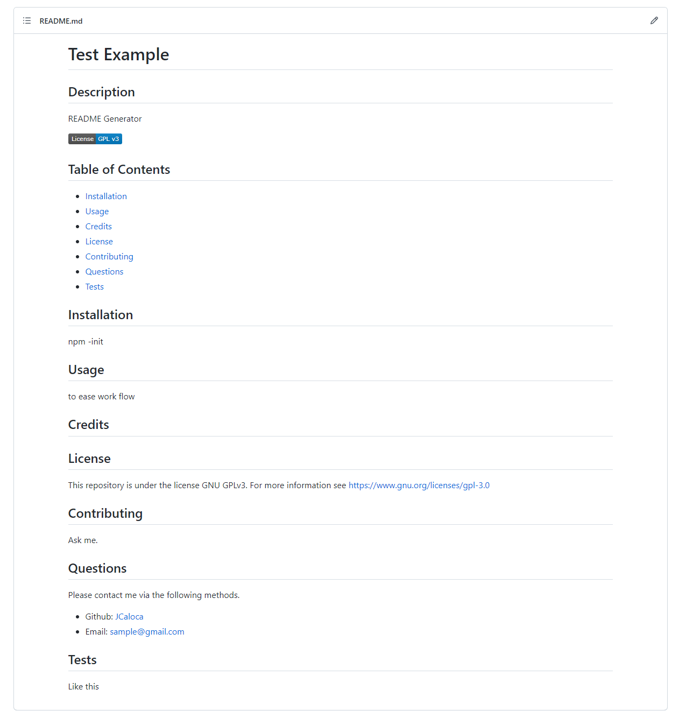

# Professional README Generator

## Description

An application to generate a README file formatted to your liking. It is run through the command line via Nodejs

## Table of Contents

- [Installation](#installation)
- [Usage](#usage)
- [Credits](#credits)
- [License](#license)
- [Contributing](#contributing)
- [Questions](#questions)
- [Tests](#tests)

## Installation

npm -init

## Usage

Link to view video of [application](https://drive.google.com/file/d/1ksLaXOlR5w2aKtisgfok9KjeGmrUe-vS/view)

Example of generated README.md:

## License

This application is open source.

## Contributing

Contact me.

## Questions

Please contact me via the following methods.

- Github: [JCaloca](https://github.com/JCaloca)
- Email: sample@gmail.com

## Tests

No tests available.
